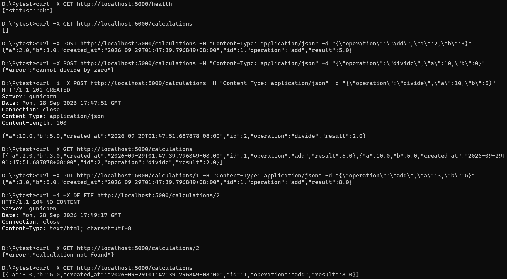

# 1. Introduction

使用 pytest 實作數學運算單元測試、API 測試、fixture 與 mock 整合測試，後端及資料庫分別採用 Flask 與 PostgreSQL。  
提供 API 服務狀態檢查，以及數學運算紀錄的新增、查詢、更新與刪除功能，並支援依 ID 操作單筆紀錄、驗證錯誤輸入，以 JSON 作為 API 的請求與回應格式。

## 專案特色

- 提供狀態檢查 API，確認服務是否正常運作
- 建立計算紀錄，執行指定的數學運算並儲存結果
- 查詢全部計算紀錄
- 依照 ID 查詢單筆計算紀錄
- 依照 ID 更新既有紀錄並重新計算結果
- 依照 ID 刪除計算紀錄
- 驗證 operation、必要欄位、數字格式及除以零等錯誤輸入
- 使用 JSON 作為 API 的請求與回應格式

## 支援的數學運算

`operation` **僅支援**以下模式：

| operation | 運算 | 範例 | 結果 |
|---|---|---|---|
| `add` | 加法 | `a = 2, b = 3` | `5.0` |
| `divide` | 除法 | `a = 10, b = 5` | `2.0` |

以下情況均回傳 HTTP 400：

- 傳入其他值 (如 `subtract` 或 `multiply` )屬於未知操作
- 缺少欄位、`a` 或 `b` 的值為非數字
- 除以 `0`

## 專案結構

```text
.
├── app/
│   ├── __init__.py       # application factory 與設定
│   ├── database.py       # SQLAlchemy model
│   ├── routes.py         # Flask CRUD API
│   └── services.py       # 可被模擬的外部稽核服務
├── tests/
│   ├── conftest.py       # pytest fixtures
│   ├── test_database.py  # DB 與持久化測試
│   ├── test_routes.py    # GET/POST/PUT/DELETE 與錯誤輸入
│   └── test_services.py  # 模擬外部 HTTP 呼叫
├── calculator.py         # 純函式，適合 unit test
├── test_calculator.py    # 最基礎的 pytest 測試
├── Dockerfile
├── compose.yaml
├── requirements.txt
└── pytest.ini
```

# 2. Installation (Docker Compose)

複製環境變數範例，並依需求修改資料庫密碼與連線設定：

```powershell
Copy-Item .env.example .env
```

啟動服務：

```bash
docker compose up -d --build
```

# 3. Usage

## 測試 API 服務狀態

```bash
curl -X GET http://localhost:5000/health
```

瀏覽器開啟 `http://localhost:5000/health`，預期得到：

```json
{"status":"ok"}
```

## 建立一筆計算

```bash
curl -X POST http://localhost:5000/calculations -H "Content-Type: application/json" -d "{\"operation\":\"add\",\"a\":2,\"b\":3}"
```

含狀態碼 (Response Header)：

```bash
curl -i -X POST http://localhost:5000/calculations -H "Content-Type: application/json" -d "{\"operation\":\"divide\",\"a\":10,\"b\":5}"
```

## 更新一筆 ID 計算

```bash
curl -X PUT http://localhost:5000/calculations/1 -H "Content-Type: application/json" -d "{\"operation\":\"add\",\"a\":3,\"b\":5}"
```

## 刪除一筆 ID 計算

```bash
curl -X DELETE http://localhost:5000/calculations/2
```

## 查詢紀錄

```bash
curl -X GET http://localhost:5000/calculations
```

查詢單筆 ID 紀錄：

```bash
curl -X GET http://localhost:5000/calculations/2
```

# 4. Uninstallation

```bash
docker compose down
```

清除資料庫：

```bash
docker compose down -v
```

# 5. API Endpoints

| Method | Path | 用途 |
|---|---|---|
| GET | `/health` | 狀態檢查 |
| GET | `/calculations` | 列出所有紀錄 |
| GET | `/calculations/<id>` | 取得單筆紀錄 |
| POST | `/calculations` | 建立計算紀錄 |
| PUT | `/calculations/<id>` | 更新並重新計算 |
| DELETE | `/calculations/<id>` | 刪除紀錄 |

POST/PUT **須使用** JSON 格式：

```json
{
  "operation": "divide",
  "a": 10,
  "b": 5
}
```

# 6. Demo


